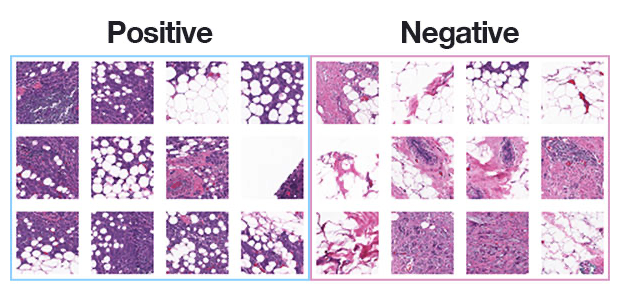

# Breast cancer classification with Deep Learning

Python script to split input dataset into three sets:
- training set
- validation set
- testing set

Then use Convolution Neural Networks for Cancer detection

Each image in the dataset has a specific filename structure. 
An example of an image filename in the dataset can be seen below:

10253_idx5_x1351_y1101_class0.png

We can interpret this filename as:

Patient ID: 10253_idx5

x-coordinate of the crop: 1,351

y-coordinate of the crop: 1,101

Class label: 0 (0 indicates no IDC while 1 indicates IDC)

Dataset consist of these pictures (positive and negative examples):

# Convolution neural network - CancerNet

CancerNet consist of:
- 3x3 CONV filters (similar to VGGNet)
- stacks multiple 3x3 CONV filters on top of each other prior to performing max-pooling (again, similar to VGGNet)
- But unlike VGGNet, uses depthwise separable convolution rather than standard convolution layers

Depthwise separable convolution:
- Is more efficient
- Requires less memory
- Requires less computation
- Perform better than standard convolution in some situations

## RESULT:

Deep learning algorithm can recognize cancer with around 85% accuracy. 

Better information is to look on sensitivy and specificity.

Sensitivity measures the proportion of the true positives that were also predicted as positive (around 85%).

Specificity measures true negatives (84.70%).

You need to be really careful with false negative here — you don’t want to classify someone as “No cancer” when they are in fact “Cancer positive”.

False positive rate is also important — you don’t want to mistakenly classify someone as “Cancer positive” and then subject them to painful, expensive, and invasive treatments when they don’t actually need them.

